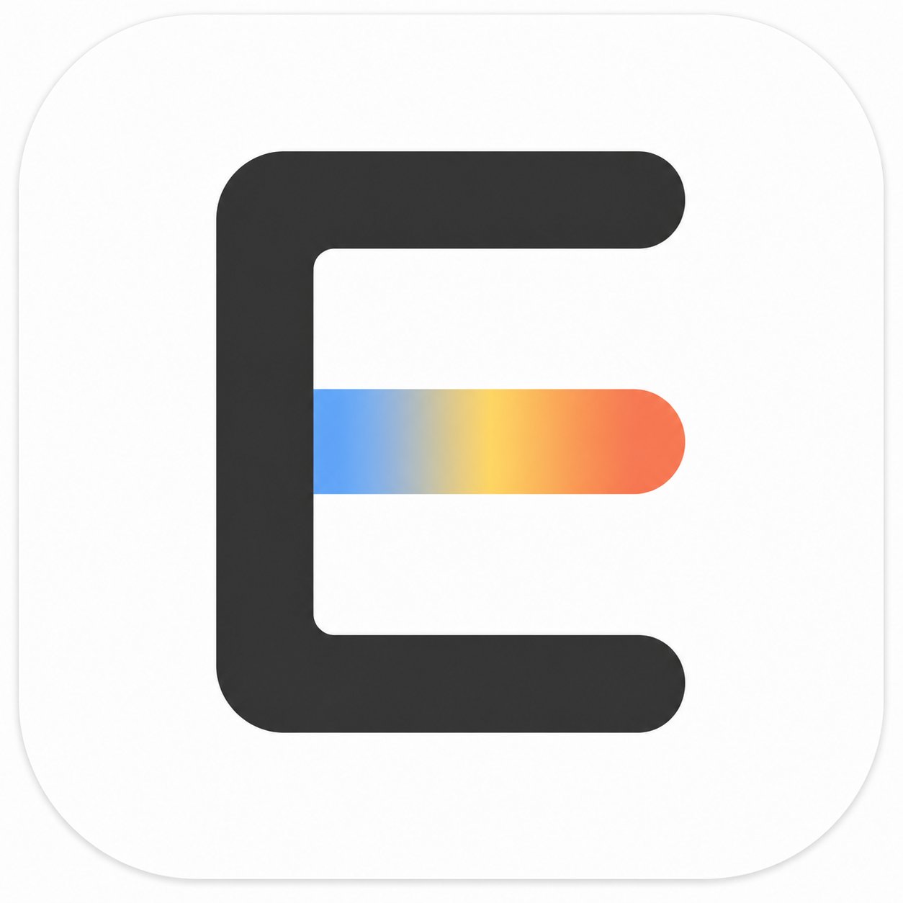

# Eliot's AI Layer

一个轻量、原生的 macOS 菜单栏划词工具。选中文字后自动显示半透明工具条，可进行翻译、总结、解释、润色、Google 搜索、复制、朗读和自定义提问。



[下载最新版本](https://github.com/seamas0825-lab/eliots-ai-layer/releases/latest) · [查看源码](https://github.com/seamas0825-lab/eliots-ai-layer)

同时内置本地剪贴板历史：自动记录文本、链接、图片和文件位置，可通过自定义全局快捷键或单击菜单栏图标呼出，搜索后双击即可粘贴回原窗口。选中图片时会在右侧显示清晰预览，也可用系统原生 Quick Look 打开大图。历史上限可在 1–1000 条之间设置；图片保存在本机应用数据目录，文件仅保存原始路径，不会复制文件本体。带有 macOS 机密或临时标记的剪贴板内容不会记录。

## 使用

1. 从 [Releases](https://github.com/seamas0825-lab/eliots-ai-layer/releases/latest) 下载 DMG，把 `Eliot's AI Layer.app` 移到“应用程序”文件夹并打开。
2. 在首次弹出的设置中授予“辅助功能”权限。如果升级后仍显示未授权，请先在系统设置中移除旧条目，再重新添加 `/Applications/Eliot's AI Layer.app`。
3. 填写 OpenAI Chat Completions 兼容的 API 地址、模型和 API Key。
4. 在任意支持 macOS 辅助功能的应用中选中文字。
5. 默认按 `⌥⌘V` 或单击菜单栏图标打开剪贴板历史；可在设置中修改快捷键与保存数量。

微信不公开标准的辅助功能选中文本。应用会仅在微信完成划词时临时执行一次复制、读取文字后立即恢复原剪贴板，从而兼容微信而不覆盖原有剪贴板内容。

点击“翻译”会自动把中文翻译成英文、把其他语言翻译成简体中文。点击旁边的箭头可从按总使用人数排序的 100 种语言中指定目标语言。译文出现后，仍可在结果面板顶部切换语言；应用始终用最初选中的原文重新翻译，避免连续翻译造成失真。

API Key 保存在 macOS 钥匙串中。调用翻译、总结等 AI 功能时，选中的文字会发送给你配置的 API 服务；复制和朗读均在本机完成。

AI 结果会显示在独立的原生浮层中；即使原来的应用仍在前台，结果浮层也会保持可见。

请始终从“应用程序”文件夹运行，不要同时运行 DMG 或开发目录里的副本。macOS 会把不同路径或不同签名的副本视为不同的辅助功能授权对象。

## 支持的接口

接口需兼容 `POST /chat/completions`，并使用 `Authorization: Bearer <API Key>`。API 地址可以填写到 `/v1`，应用会自动补全路径。

## 功能

- 任意窗口划词后呼出原生悬浮工具栏
- 自动中英互译，以及按使用人数排序的 100 种目标语言
- 总结、解释、润色、Google 搜索、复制、朗读和自定义提问
- 本地剪贴板历史，支持文本、链接、图片与文件位置
- 图片预览、历史搜索、双击粘贴与自定义全局快捷键
- 历史数量可设置为 1–1000 条
- API Key 仅保存在 macOS 钥匙串

## 开发与构建

要求：macOS 14 或更高版本，以及支持 Swift 6 的 Xcode Command Line Tools。

```bash
swift run SelectAI --self-test
./build_app.sh
```

构建完成后，应用位于 `dist/Eliot's AI Layer.app`。开发构建使用本机临时签名；公开分发时建议使用 Apple Developer ID 签名并完成公证。

## 隐私说明

- 剪贴板历史保存在本机应用数据目录。
- 文件类剪贴板仅记录原始文件位置，不上传或复制文件本体。
- API Key 保存在 macOS 钥匙串，不写入项目或配置文件。
- 只有主动调用 AI 功能时，所选文本才会发送到用户配置的 API 服务。

## 参与贡献

欢迎提交 Issue 和 Pull Request。涉及辅助功能权限、剪贴板或网络请求的修改，请在 PR 中说明隐私和安全影响。

## 开源许可证

本项目采用 [MIT License](LICENSE) 开源。
